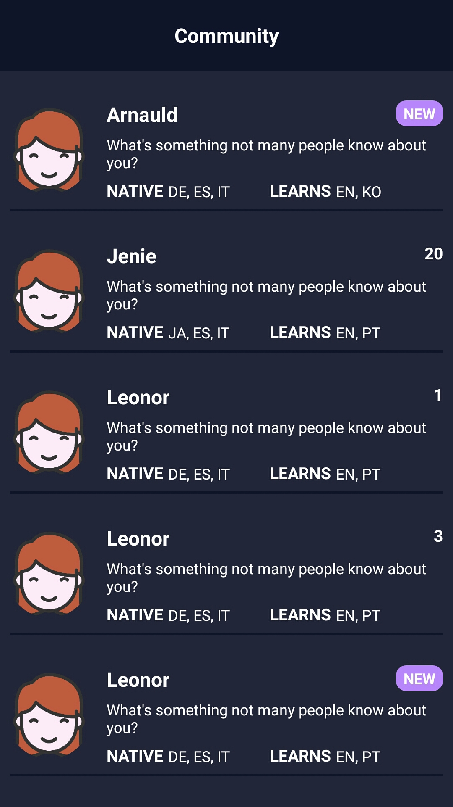
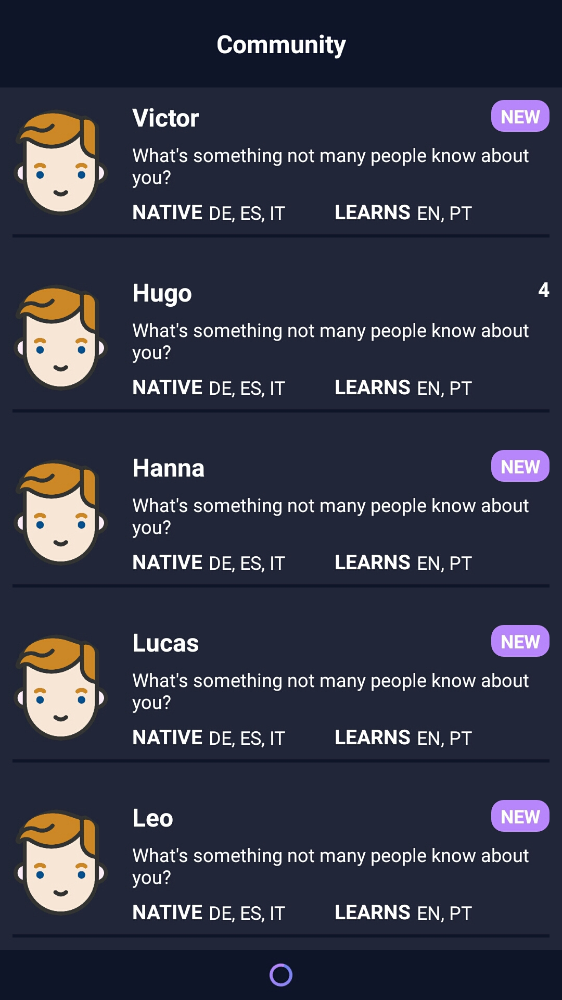
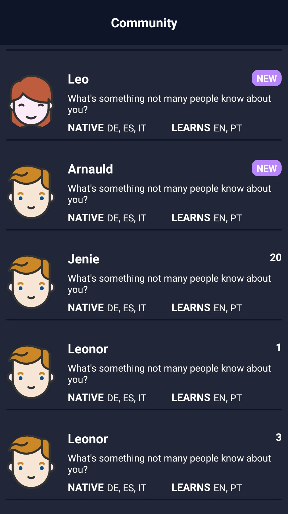

# Language Tandem Application
## Introduction
Language Tandem Application helps you to find your language tandem in the community. Briefly, when a user wants to learn a language, he/she can find users speaking that native language. In return, user can teach his/her language. A simple UI is designed for application to make it user-friendly and easy to use. When a user joins shortly, he/she will have "New" badge on the screen to help him/her find tandem quickly.

## Screenshots from the application

  
  
  
  

## Documentation
You can find more about this application from [here](./docs).

## Check Items
- [X] Create diagram for application architecture
- [X] Initialize the application
- [X] Implement MVVM architecture
    - [X] Data model
    - [X] Service layer
    - [X] Repository
    - [X] Pagination
    - [X] View Model
    - [X] UI
- [X] Create tests
- [X] Documentation
