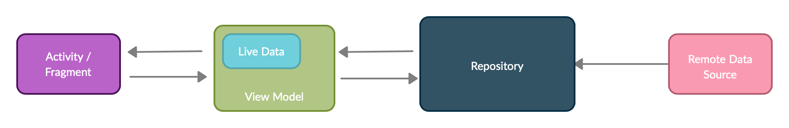

# Find Language Tandem App Documentation


## Architecture

In this project, SOLID design principles are implemented and MVVM architecture is used to remove tight coupling between each component and apply seperation of concerns. Child classes do not have direct reference to parent, they only have reference by observables. It consists of 3 main components:

 * Model represents data and business logic for the application. Model consists of remotedata sources(CommunityDataSource), model classes(TandemData and Status), and Tandem Repository.
 * View consists of UI elements such as fragments and activities. It listens and sends to user actions to view model(CommunityViewModel), then subscribes the observables from view model to update the UI in CommunityFragment.
 * View Model(CommunityViewModel) is a bridge between view(CommunityFragment) and model. It does not have direct reference to view, therefore view model does not know which view will use the data. It interacts with the model and create observables for the view.

<p float="left">
  
</p>


## Pagination

In this project, paging library is used to fetch data dynamically when it is required(a user scrolls the list). The paging library helps to load and display small chunks of data at a time. Therefore, it reduces usage of network and system resources. It provides data as LiveData, thus we can observe changes in data and update the UI in fragment. In terms of lifecycle awareness, it will not do any work if the user is not on the screen related to data.

 * PagedList(tandemList) — It is the key component in Paging library, which is a list collection that loads chunks of TandemData asynchronously. If any loaded data changes, a new instance of PagedList is emitted to the observable data holder from a LiveData. As PagedList objects are generated, CommunityFragment presents data contents.
 * CommunityDataSource and CommunityDataSource.Factory — It is base class for loading snapshots of data into a PagedList. A DataSource.Factory is responsible for creating a DataSource.
 * LivePagedListBuilder — It builds a LiveData<PagedList>, based on DataSource.Factory and a PagedList.Config(the configuration file for paging). Page size is 20.
 * PagedListAdapter — It is a RecyclerView.Adapter that presents paged data from PagedLists in a RecyclerView. It listens to PagedList loading callbacks as pages are loaded and uses DiffUtil to determine updates as new PagedLists are received.

## Testing

In this project, view model test cases are created because it the most essential part of the project and it connects UI and data source. Run unit test with the following command:

```
>./gradle check
```
